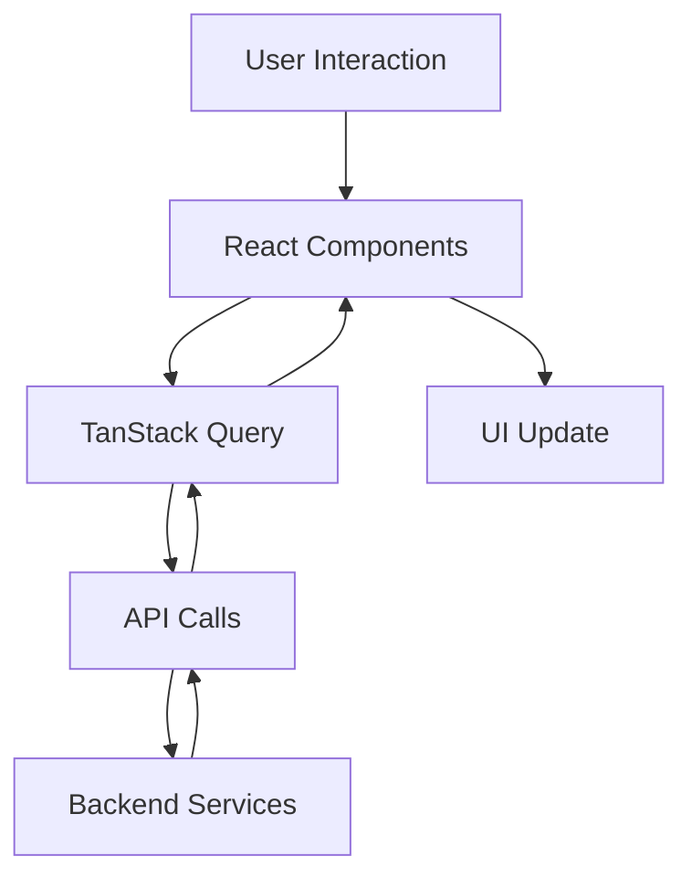
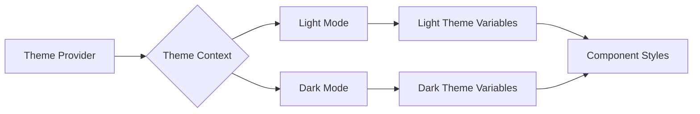
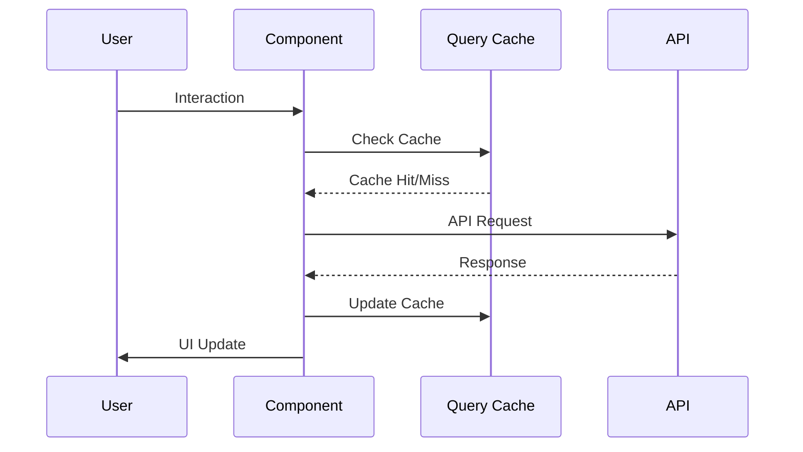
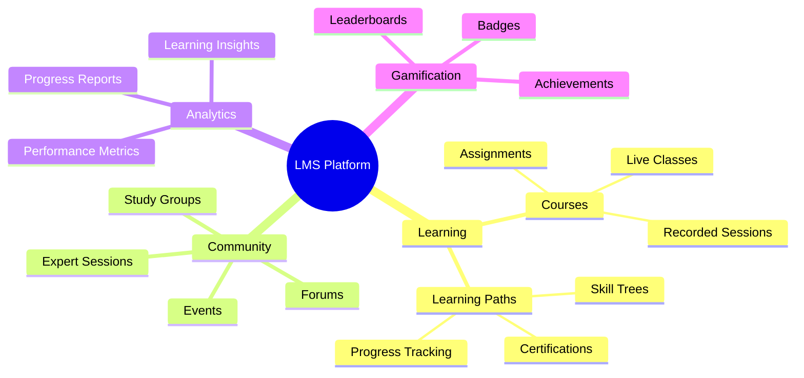

# 🚀 Advanced Learning Management System

Welcome to our cutting-edge Learning Management System! This project combines the power of React, TypeScript, and various modern technologies to create an engaging and interactive learning experience.

## 🛠 Technologies & Tools

- **Frontend**: React, TypeScript, Vite
- **UI Components**: shadcn/ui
- **Styling**: Tailwind CSS
- **State Management**: TanStack Query (React Query)
- **Routing**: React Router
- **Charts & Visualizations**: Recharts, D3.js
- **Icons**: Lucide React
- **Animations**: Framer Motion

## 🌟 Key Features

### 📊 Interactive Dashboard
- Real-time progress tracking
- Personalized course recommendations
- Upcoming events and deadlines

### 📚 Course Management
- Diverse catalog of 20+ courses across various fields
- Courses categorized by difficulty level (Beginner, Intermediate, Advanced)
- Rich media integration (video, audio, quizzes)
- Progress tracking and analytics

### 💬 Community & Forums
- Threaded discussions with nested replies
- Real-time chat integration
- Study groups and collaborative learning
- Ask an Expert feature for personalized guidance
- Coding challenges and community events
- Innovation corner for idea sharing
- Community-driven open-source projects

### 🗺 Learning Paths
- Personalized learning journeys
- Skill assessments and adaptive learning
- Interactive roadmaps with D3.js visualizations

### 📅 Calendar & Scheduling
- Event management and reminders
- Integration with external calendars
- Scheduling tools for mentorship sessions

### 🏆 Achievements & Gamification
- Badges and certificates
- Leaderboards and progress comparisons
- Skill tree visualizations

## 🔧 Setup & Installation

```bash
# Clone the repository
git clone https://github.com/your-repo/advanced-lms.git

# Navigate to the project directory
cd advanced-lms

# Install dependencies
npm install

# Start the development server
npm run dev
```

## 📁 Project Structure

```
advanced-lms/
├── src/
│   ├── components/
│   │   ├── ui/
│   │   │   └── [shadcn/ui components]
│   │   ├── Dashboard/
│   │   ├── Courses/
│   │   └── ...
│   ├── pages/
│   │   ├── Dashboard.tsx
│   │   ├── Courses.tsx
│   │   ├── Community.tsx
│   │   └── ...
│   ├── hooks/
│   ├── utils/
│   └── App.tsx
├── public/
└── [configuration files]
```

## 🔄 Data Flow



## 🎨 Theme System



## 🔄 State Management Flow



## 🛡️ Authentication Flow


## 🎯 Core Features Implementation



## 🔐 Security & Performance

### Security Measures
- JWT-based authentication
- Role-based access control
- Input validation & sanitization
- XSS & CSRF protection

### Performance Optimizations
- Code splitting & lazy loading
- Image optimization
- Caching strategies
- Performance monitoring

## 🎨 Theme Customization

Our theme system supports both light and dark modes with a premium color palette:

### Light Mode
```css
:root {
  --primary: hsl(262, 83%, 58%);
  --secondary: hsl(240, 4.8%, 95.9%);
  --accent: hsl(262, 83%, 58%);
  --background: hsl(260, 85%, 98%);
  --foreground: hsl(240, 10%, 3.9%);
}
```

### Dark Mode
```css
.dark {
  --primary: hsl(262, 83%, 58%);
  --secondary: hsl(240, 3.7%, 15.9%);
  --accent: hsl(262, 83%, 58%);
  --background: hsl(240, 10%, 3.9%);
  --foreground: hsl(0, 0%, 98%);
}
```

## 🤝 Contributing

We welcome contributions! Please see our [Contributing Guide](CONTRIBUTING.md) for more details.

## 📄 License

This project is licensed under the MIT License - see the [LICENSE](LICENSE) file for details.

## 🙏 Acknowledgements

- [React](https://reactjs.org/)
- [TypeScript](https://www.typescriptlang.org/)
- [Vite](https://vitejs.dev/)
- [shadcn/ui](https://ui.shadcn.com/)
- [Tailwind CSS](https://tailwindcss.com/)
- [TanStack Query](https://tanstack.com/query/latest)
- [Recharts](https://recharts.org/)
- [D3.js](https://d3js.org/)
- [Framer Motion](https://www.framer.com/motion/)

---

Happy Learning! 📚✨
