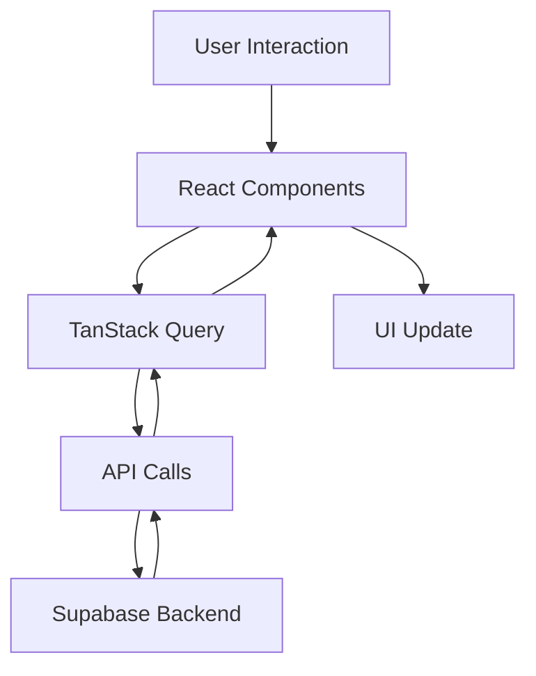
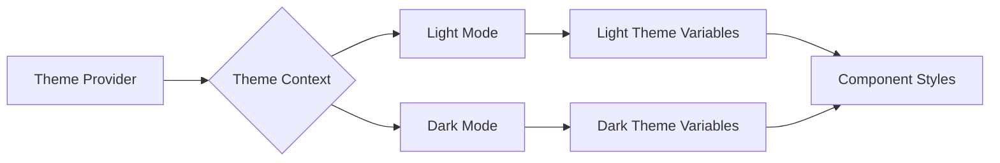
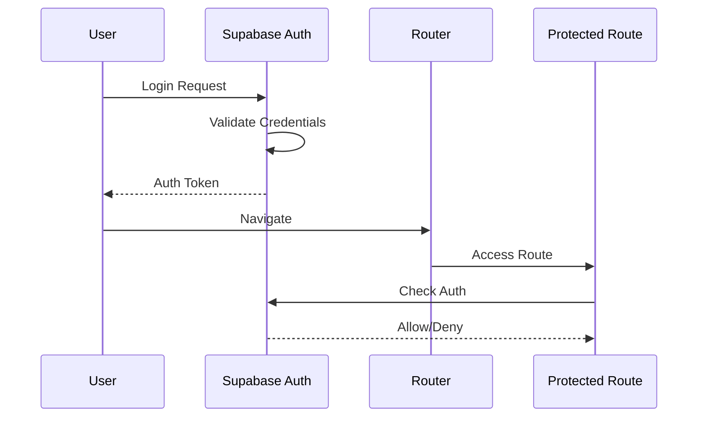
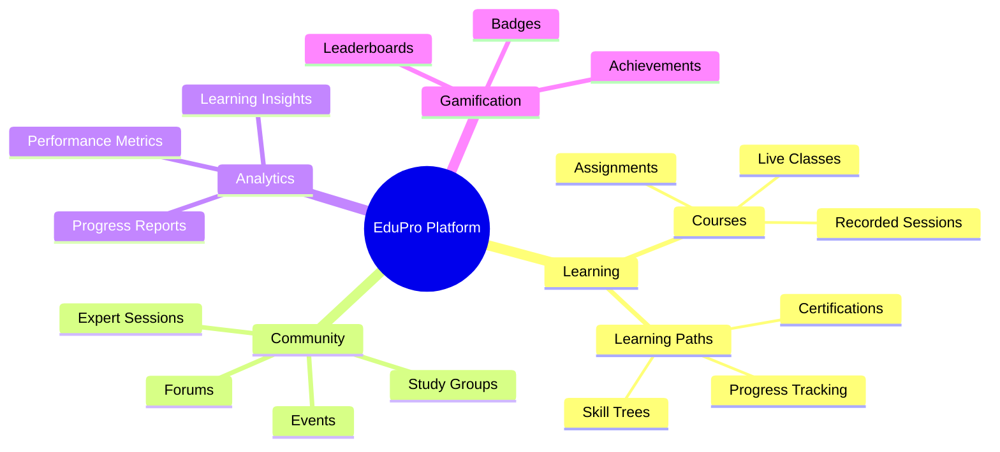

# 🚀 EduPro - Advanced Learning Management System

Welcome to EduPro, our cutting-edge Learning Management System! This project combines the power of React, TypeScript, and various modern technologies to create an engaging and interactive learning experience.

## 🛠 Technologies & Tools

- **Frontend**: React 18+, TypeScript, Vite
- **UI Components**: shadcn/ui
- **Styling**: Tailwind CSS
- **State Management**: TanStack Query (React Query) v5+
- **Routing**: React Router v6+
- **Charts & Visualizations**: Recharts, D3.js
- **Icons**: Lucide React
- **Animations**: Framer Motion
- **Database & Authentication**: Supabase
- **Toast Notifications**: Sonner
- **Form Handling**: React Hook Form, Zod
- **Date Management**: date-fns, FullCalendar
- **PDF Generation**: jsPDF, html2canvas

## 🌟 Key Features

### 📊 Interactive Dashboard
- Real-time progress tracking with dynamic charts
- Personalized course recommendations based on learning history
- Daily/weekly learning streaks and XP system
- Goals tracking and achievement monitoring
- Upcoming events and deadlines

### 📚 Course Management
- Diverse catalog of 20+ courses across various fields
- Courses categorized by difficulty level (Beginner, Intermediate, Advanced)
- Rich media integration (video, audio, quizzes)
- Interactive course player with progress saving
- Detailed progress analytics and completion certificates

### 💬 Community & Forums
- Threaded discussions with nested replies
- Real-time chat integration with mentors
- Study groups and collaborative learning spaces
- Ask an Expert feature for personalized guidance
- Coding challenges and community events
- Innovation corner for idea sharing
- Community-driven open-source projects

### 🗺 Learning Paths
- Personalized learning journeys based on career goals
- Skill assessments and adaptive learning paths
- Prerequisite course suggestions
- Interactive roadmaps with D3.js visualizations
- Path progress tracking and milestones

### 📅 Calendar & Scheduling
- Event management and reminders for deadlines
- Integration with external calendars
- Scheduling tools for mentorship sessions
- Time-blocking features for focused learning

### 🏆 Achievements & Gamification
- Badges, certificates, and learning achievements
- XP system with levels and ranks
- Leaderboards and progress comparisons
- Skill tree visualizations
- Shareable certificates with verification system

### 👤 User Profiles & Settings
- Customizable user profiles with learning statistics
- Bio, occupation, and skill tracking
- Course progress history
- Social connections with other learners
- Personalized notification preferences

### 🔍 Certificate Verification
- Secure, tamper-proof digital certificates
- Public verification portal for employers
- Blockchain-based certificate verification (coming soon)
- Certificate sharing on social platforms

## 📁 Project Structure

```
edupro-lms/
├── src/
│   ├── components/
│   │   ├── ui/              # shadcn/ui components
│   │   ├── dashboard/       # Dashboard components
│   │   ├── courses/         # Course-related components
│   │   ├── profile/         # Profile components
│   │   ├── community/       # Community components
│   │   └── achievements/    # Achievements components
│   ├── pages/
│   │   ├── Dashboard.tsx
│   │   ├── Courses.tsx
│   │   ├── LearningPaths.tsx
│   │   ├── Profile.tsx
│   │   ├── Community.tsx
│   │   └── ...
│   ├── hooks/               # Custom React hooks
│   ├── contexts/            # Context providers
│   ├── utils/               # Utility functions
│   ├── lib/                 # Library integrations
│   ├── integrations/        # Third-party integrations
│   └── App.tsx
├── public/                  # Static assets
└── [configuration files]
```

## 🔄 Data Flow Architecture



## 🎨 Theme System

Our theme system supports both light and dark modes with a premium color palette that ensures accessibility and visual appeal:



## 🛡️ Authentication Flow



## 🎯 Core Features Implementation



## 🔐 Security & Performance

### Security Measures
- JWT-based authentication with Supabase
- Row-level security for data protection
- Role-based access control
- Input validation & sanitization
- XSS & CSRF protection
- Secure certificate verification

### Performance Optimizations
- Code splitting & lazy loading
- Image optimization
- Caching strategies with React Query
- Virtualized lists for large data sets
- Performance monitoring and analytics

## 🎨 Premium UI/UX Features

- Neumorphic design elements
- Gradient accents and micro-interactions
- Responsive design for all devices
- Motion animations for improved user engagement
- Dark/light mode with smooth transitions
- Customizable UI themes
- Accessibility-first approach (WCAG compliant)
- Interactive charts and data visualizations

## 🚀 Getting Started

```bash
# Clone the repository
git clone https://github.com/your-repo/edupro-lms.git

# Navigate to the project directory
cd edupro-lms

# Install dependencies
npm install

# Start the development server
npm run dev
```

## 🌐 Environment Setup

Create a `.env` file in the root directory with the following variables:

```
VITE_SUPABASE_URL=your_supabase_project_url
VITE_SUPABASE_ANON_KEY=your_supabase_anon_key
```

## 🤝 Contributing

We welcome contributions! Please see our [Contributing Guide](CONTRIBUTING.md) for more details.

## 📄 License

This project is licensed under the MIT License - see the [LICENSE](LICENSE) file for details.

## 🙏 Acknowledgements

- [React](https://reactjs.org/)
- [TypeScript](https://www.typescriptlang.org/)
- [Vite](https://vitejs.dev/)
- [shadcn/ui](https://ui.shadcn.com/)
- [Tailwind CSS](https://tailwindcss.com/)
- [TanStack Query](https://tanstack.com/query/latest)
- [Recharts](https://recharts.org/)
- [D3.js](https://d3js.org/)
- [Framer Motion](https://www.framer.com/motion/)
- [Supabase](https://supabase.com/)

---

Happy Learning! 📚✨
